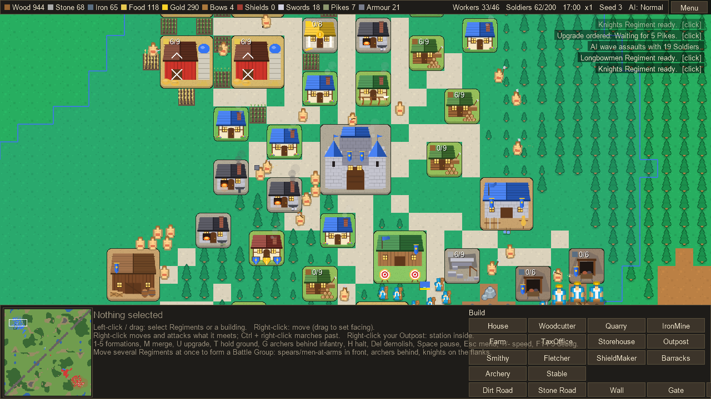
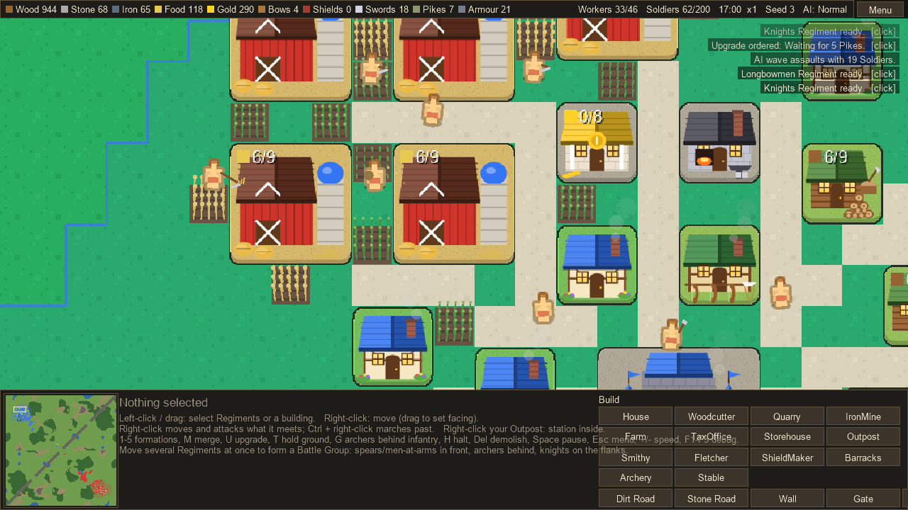
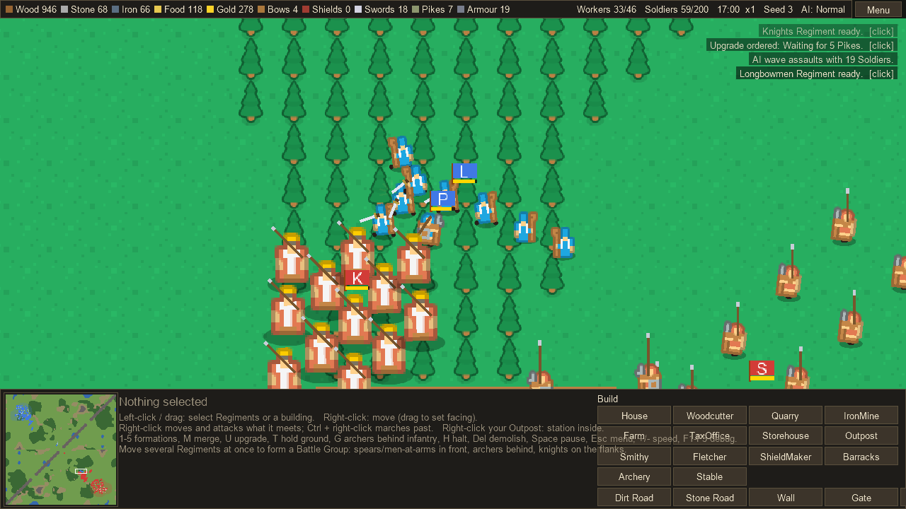
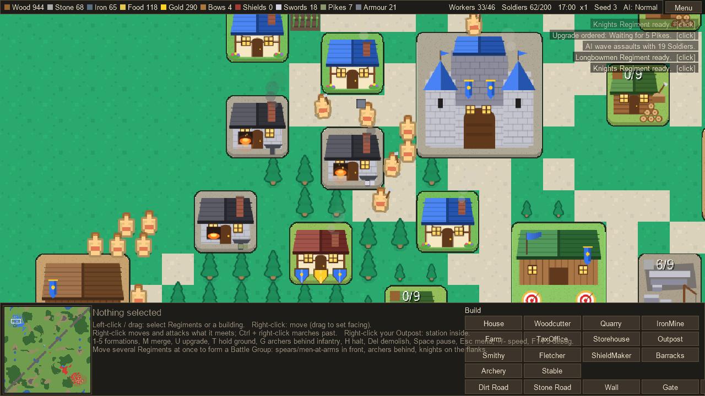

# Banner & Barrow

A medieval real-time strategy game where you grow a town, feed the people in it, arm them, and then march them
out in Regiments to take the enemy's Keep. It is a prototype: playable end to end against an AI opponent, still
rough around the edges.

## What kind of game is it

It takes the town-building half from **The Settlers** (especially *Settlers: Rise of an Empire*): you don't
click out individual villagers, you place buildings and the Workers sort themselves out, walking goods from
where they are made to where they are needed. Nothing appears by magic — a sword exists because a miner dug the
iron, a carrier brought it to a Storehouse and a smith hammered it.

The fighting half is closer to **a medieval battle game** than to a click-fest: Soldiers belong to Regiments that
hold a formation, face a direction, and care about where they are hit. Flanks and rear are soft, a charge into a
formed line is worth less than one into scattered men, spears hurt cavalry, and archers are murderous at range
and helpless up close.

The two halves are joined at the hip: an army is exactly as good as the economy behind it.

## The loop

1. **Gather.** Woodcutters, Quarries and Iron Mines feed Storehouses. Storehouses define your Territory, and you
   can only build inside it, so expanding means placing Storehouses further out.
2. **Feed.** Farmers sow Fields around the Farm, wait for the crop and harvest it. Every Worker eats, and a new
   Worker costs Food. Run out and everything slows to half speed.
3. **Make.** A Fletcher turns Wood into Bows, a Shield Maker turns Wood and Iron into Shields, a Smithy makes
   Swords, Pikes and Armour. Workshops make what is on order first, then keep a small stock.
4. **Recruit.** Barracks, Archery and Stable train Regiments from those goods. Spearmen are cheap and weak;
   upgrade them into Pikemen when you can afford Pikes and Armour.
5. **Fight.** March out, or fortify with Outposts, Strongholds and Walls, and take the enemy Keep before they
   take yours.

## What we tried to get right

- **Goods have a journey.** Every item is carried by someone. If your Smithy sits idle, some Worker somewhere is
  walking, or missing, or hungry.
- **Distance costs.** Roads double Worker speed, so a sprawling town without roads starves its own workshops.
- **Fog of war that cuts both ways.** You see your own Territory and around your Regiments and forts. The AI is
  under the same fog: it guesses where your Keep is, scouts for it, and only reacts to what it has seen. Anyone
  who attacks you gives themselves away for a few seconds.
- **Formations that mean something.** A Line takes a charge; Loose order spreads out under arrows; a Column
  marches fast; a Wedge is for Knights. Men with shields raise them when arrows are in the air.
- **Sieges that look like sieges.** Attackers throw torches, fires spread across a roof, and a building that
  catches badly enough burns down. Arrows kill defenders but never knock a building over.
- **An opponent with a plan.** The AI picks an opening (boom or rush), keeps a peace window, then escalates:
  small raids on your economy first, later waves that gather at a staging point and assault together. Attack it
  early and it gets angry and escalates faster.

## Install and play

Grab **BannerAndBarrow-win-Setup.exe** from the
[latest release](https://github.com/cyberneticza/BannerAndBarrow/releases). It installs for your Windows user
only (no admin prompt), adds Start Menu and Desktop shortcuts, and needs no .NET install. Windows may warn
about an unsigned installer: **More info → Run anyway**. There is also a portable zip if you would rather not
install anything.

To run from source: `dotnet run --project src/BannerAndBarrow.Game` (needs the .NET 9 SDK).

**First five minutes:** build a Woodcutter and a Quarry near your Keep, a Farm on open grass, then a House when
the top bar warns about jobs waiting. Lay Dirt Roads from your buildings to the Keep. Put up a Barracks by
minute three, and keep an eye out around minute two, when the AI's first raids arrive.

The [player's manual](docs/manual.md) explains every building, unit and control, and what to watch out for.

## Documentation

| Document | For |
|---|---|
| [Player's manual](docs/manual.md) | How to play: controls, buildings, goods, units, formations, sieges, tactics |
| [Technical specification](docs/technical-spec.md) | How it is built: architecture, determinism, systems, AI, rendering, tests |
| [Distribution](docs/distribution.md) | Building releases and the installer |
| [CONTEXT.md](CONTEXT.md) | The project's vocabulary (Regiment, Territory, Presence, Goods, Fire, ...) |

## State of the prototype

Working: the full economy, fog of war, Regiments and formations, walls and gates, sieges with fire, the AI
opponent at three difficulties, menus and settings, positional sound, and a Windows installer.

Not there yet: multiplayer, save and load, and campaign or scenario play. Balance is rough — the AI often wins
or loses on Normal, but some matches stalemate when both sides run out of Iron. The Soldiers' voice lines are
placeholders made with Windows text-to-speech, and should be replaced with real recordings.

## Licence

The game's code is [MIT licensed](LICENSE): use it, change it, build on it, ship it, commercially or not — just
keep the copyright notice. The art and sound effects are Kenney's, released under
[CC0](https://creativecommons.org/publicdomain/zero/1.0/) (public domain, no attribution required), and the
buildings, effects, horns, drums and fire are generated by this repository's own code and tools.

The Soldiers' voice lines in `Content/Audio/Voice` are placeholders rendered with the Windows speech
synthesiser. Replace them with your own recordings before shipping anything.

Art is Kenney's [Medieval RTS](https://kenney.nl/assets/medieval-rts) pack (CC0) plus buildings and effects
painted in code; sound is Kenney's CC0 audio packs plus synthesized horns, drums and fire.
